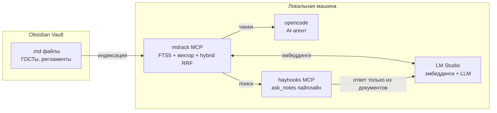

# Цифровой инженер-ассистент

Локальный ИИ-ассистент поверх любой markdown-базы знаний (Obsidian-vault): регламенты, ГОСТы, техдокументация, внутренние инструкции. Отвечает на вопросы строго по документам, без галлюцинаций. Всё работает локально: ни один файл не покидает компьютер.

## Проблема

У инженера или команды накопились сотни markdown-файлов в Obsidian: регламенты, стандарты, инструкции, протоколы. Проблемы:

- поиск вручную по сотням файлов медленный;
- обычный LLM-ассистент без базы **уверенно выдумывает**: уточни номер стандарта или значение, ответит с потолка (в пилотном кейсе ассистент путал ГОСТ 22.13330 с 21.1101, реальный случай);
- облачные сервисы нельзя подключить, если документы конфиденциальны.

## Решение

RAG-обвязка поверх vault, работает с любой markdown-базой. Три слоя:

```
Obsidian vault (.md)
  │
  ├─ mdrack ──── индекс: SQLite FTS5 (полнотекст) + векторный поиск,
  │              эмбеддинги через LM Studio, гибридный ранжир RRF.
  │              Отдаёт чанки — как цитаты из документов.
  │
  ├─ AI-агент (opencode) ─── подключён к mdrack как MCP-инструмент:
  │              ищет → читает контекст → отвечает, опираясь на чанки.
  │
  └─ ask_notes (Haystack + hayhooks) ─── отдельный MCP-инструмент
                 с фиксированным инженерным промптом: «отвечай только
                 из найденных документов, без домыслов». Готовый
                 проверяемый ответ, а не поиск по кусочкам.
```

## Архитектура



## Компоненты

| Компонент | Роль |
|---|---|
| **Obsidian vault** | Источник истины: ГОСТы, регламенты, инструкции в .md |
| **mdrack** | Свой RAG: индексация, чанкинг по заголовкам, FTS5 + векторный поиск, hybrid RRF, MCP-сервер и CLI |
| **LM Studio** | Локальные эмбеддинги (qwen3-embedding) и LLM — ничего не уходит в облако |
| **opencode** | AI-агент с доступом к mdrack как MCP-инструменту |
| **Haystack / hayhooks** | `ask_notes` — MCP-инструмент с фиксированным промптом «только из документов» |

## Где применяется

Базовый сценарий: **инженерная документация**, ГОСТы, СНиПы, регламенты, протоколы испытаний. Но сам инструмент универсальный:

- юрист: поиск по договорной базе и внутренним регламентам;
- медицина: клинические протоколы и инструкции (внутренний периметр);
- поддержка: база знаний продукта и troubleshooting-гайды;
- любая команда, чья работа держится на markdown-заметках в Obsidian.

ГОСТы здесь пилотный кейс, а не ограничение.

## Ключевые решения

- **Всё локально**: корпоративная база знаний не покидает машину. Подробнее: [ADR-001](docs/decisions/0001-local-first.md).
- **Свой mdrack**, а не готовый векторный DB: .md-файлы требуют умного чанкинга (заголовки, таблицы, код-блоки). Подробнее: [ADR-002](docs/decisions/0002-mdrack.md).
- **Regex-слой для номеров ГОСТ**: токенизация по точкам ломает «22.13330», поэтому номера ищутся точечно, а BM25/гибрид идут вторым слоем. Подробнее: [ADR-003](docs/decisions/0003-gost-numbers.md).

## Статус

| Этап | Состояние |
|---|---|
| mdrack: индексация + text/semantic/hybrid поиск + MCP | ✅ работает |
| Индексация полного vault (804 .md-файла) | 🔄 выполняется |
| Агент opencode с mdrack в связке | ✅ работает |
| ask_notes (Haystack/hayhooks) | 📋 план |

## Roadmap

- [x] Индексация и гибридный поиск по markdown
- [x] MCP-сервер mdrack, подключение к агенту
- [ ] Полная индексация vault + инкрементальное обновление
- [ ] `ask_notes` — Haystack-пайплайн с фиксированным промптом
- [ ] Regex-экстрактор номеров ГОСТ + точечный поиск
- [ ] Тест-сет «запросы инженера» с проверкой на галлюцинации

## Быстрый старт

```bash
# 1. LM Studio: запустить, загрузить эмбеддинг-модель (localhost:1234)

# 2. mdrack: проиндексировать vault
python -m mdrack scan --root /путь/к/vault

# 3. Поиск (CLI)
python -m mdrack search "устройство фундаментов" --mode hybrid

# 4. В opencode: mdrack подключается как MCP-сервер
#    (см. opencode.json → mcp → mdrack)
```

## Лицензия

MIT
